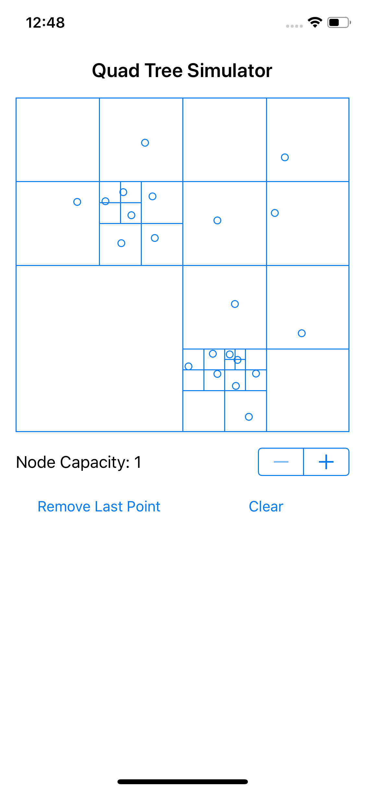

# quad-tree-simulator

Swift implementation of a [Quad Tree](https://en.wikipedia.org/wiki/Quadtree) and a simple simulator/visualizer to view the
structure of the tree in real time.

### Purpose

No specific purpose in mind behind this project.  Inspired by playing around with quad tree based solutions for map marker clustering.

### Limitations

* Each point added to the quad tree must be unique.
* The merge case when removing points could likely be optimized.

### Screenshots

